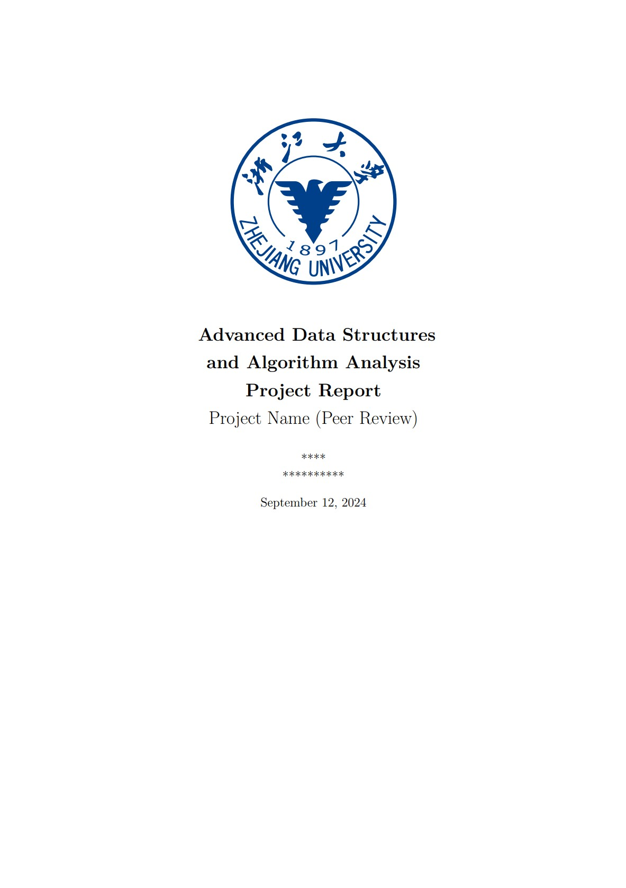
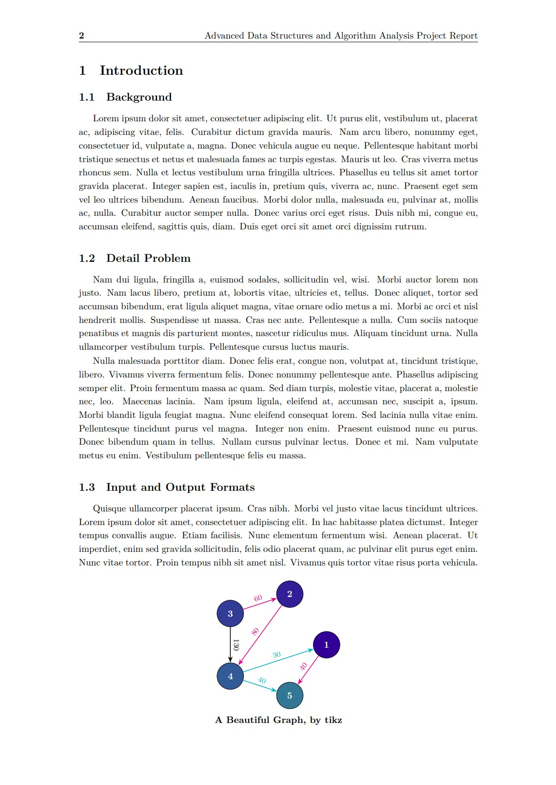
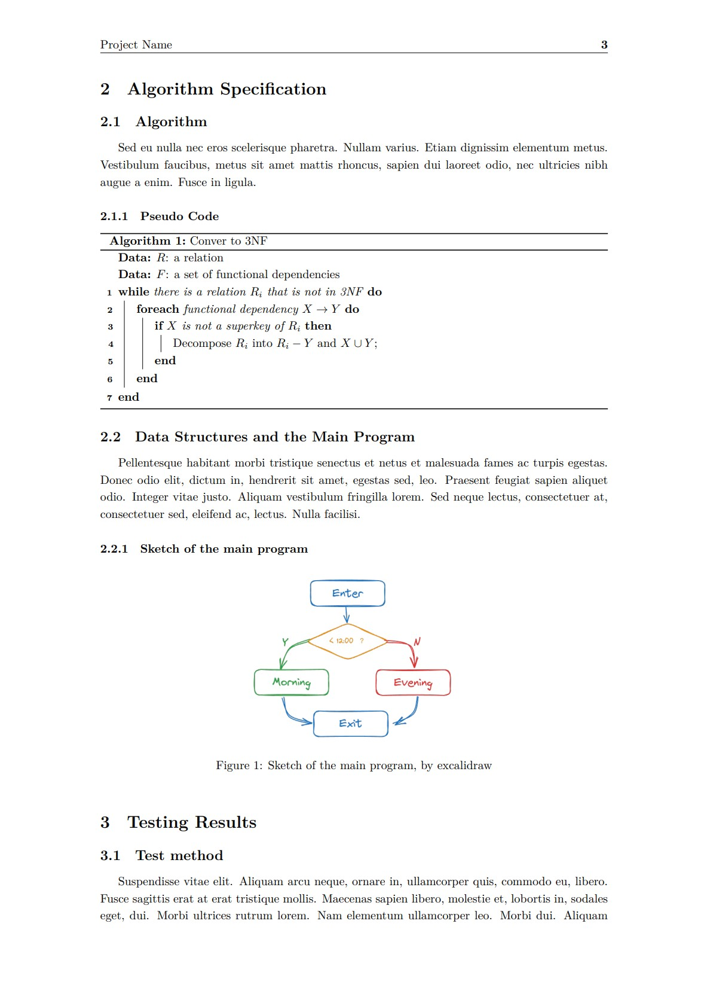

# 浙江大学《数据结构基础》《高级数据结构与算法分析》报告模板

LaTeX template for FDS / ADS courses of Zhejiang University.

针对互评要求，添加了隐藏个人信息相关的宏，可以控制是否生成 PR 版本的 PDF.

给那些在 2024 年还愿意使用 LaTeX 写报告的同学做个参考。

如果觉得 LaTeX 太麻烦，或许可以尝试 [memset0](https://github.com/memset0) 大佬写的 [Typst 模板](https://github.com/memset0/ZJU-Project-Report-Template).

# 使用说明

**本仓库只是一个报告模板，不包括任何报告的具体内容和写作建议。**

**请务必遵守 [诚信守则](https://www.zhihu.com/question/68235594/answer/261395370) 以及本仓库的 [License](LICENSE) : )**

## 预览

|                 Screenshots                 |
| :-----------------------------------------: |
|  |
|  |
|  |

或者直接查看 [report.pdf](report.pdf) 文件

## 使用方法

1. 安装 `texlive`，最好是 `full` 版本

2. 你可以通过 `make` 来生成 PDF, 当然你也可以自己给 Visual Studio Code 配置 LaTeX Workshop 插件，或者使用 Overleaf 在线编辑

```bash
make clean
make
```
